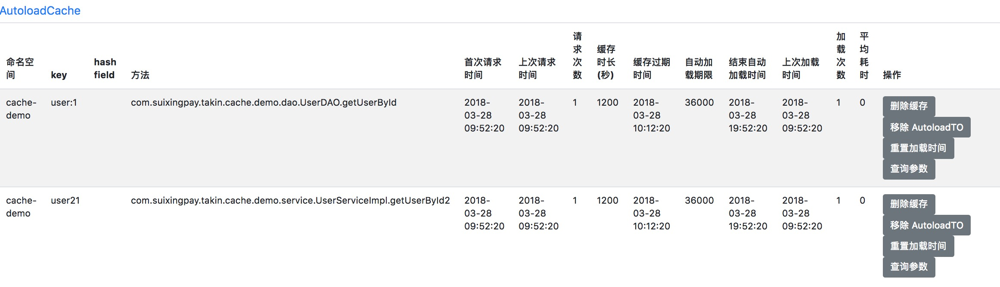

# 缓存框架使用说明
作者：邱家榆

---

缓存架构思想，请参考 infoq 中的文章：

* [《面对缓存，有哪些问题需要思考？》](http://www.infoq.com/cn/articles/thinking-about-distributed-cache-redis)

* [《再谈缓存的穿透、数据一致性和最终一致性问题》](https://mp.weixin.qq.com/s?__biz=MzIwMzg1ODcwMw==&mid=2247487343&idx=1&sn=6a5f60341a820465387b0ffcf48ae85b)

更多详细资料请查阅[AutoLoadCache](https://github.com/qiujiayu/AutoLoadCache)官网。

## 1. 在项目中增加jar 包的依赖

    compile "com.suixingpay.starter:suixingpay-starter-cache:xxx"
    
[获取最新版本](http://172.16.60.188:8081/nexus/index.html#nexus-search;quick~suixingpay-starter-cache)

## 2. 配置redis

 按org.springframework.boot.autoconfigure.data.redis.RedisProperties 进行配置
 
 1. 单机版Redis配置
 
        spring: 
          redis: 
            host: 172.16.135.249
            port: 6379
            pool: 
              maxWait: 1500
              maxActive: 2048
              minIdle: 20
              maxIdle: 200
        
 2. 集群配置
 
         spring: 
          redis: 
            cluster:
              nodes:
              - 10.7.100.95:7000
              - 10.7.100.95:7001
              - 10.7.100.95:7002
              - 10.7.100.95:7003
              - 10.7.100.95:7004
              - 10.7.100.95:7005
              - 10.7.100.95:7006
            pool: 
              maxWait: 1500
              maxActive: 2048
              minIdle: 20
              maxIdle: 200

以上Redis的两种配置，只要选择一种即可；

## 3. 配置autoload-cache

    suixingpay: 
      autoload: 
        cache: 
          enbale: true                 # 是否启用缓存操作, 默认值为true
          enable-read-and-write: true  # 是否启用@Cache注解，默认值为true （3.0.2 版本才开始有的功能）
          enable-delete: true          # 是否启用@DeleteCache和@DeleteCacheTransactional注解，默认值为true（3.0.2 版本才开始有的功能）
          proxyTargetClass: true      # AOP是否启用proxyTargetClass,默认值为true
          namespaceEnable: true       # 是否启用命名空间，默认为true
          cacheOrder: 2147483647      # @Cache 注解AOP执行顺序, 默认值为：2147483647
          deleteCacheOrder: 2147483647      # @DeleteCache 注解AOP执行顺序, 默认值为：2147483647
          deleteCacheTransactionalOrder: 0      # @DeleteCacheTransactional 注解AOP执行顺序, 默认值为：0
          config:
            namespace: test            #命名空间
            threadCnt: 10              #处理自动加载队列的线程数量
            maxElement: 20000          #自动加载队列中允许存放的最大容量
            printSlowLog: true         #是否打印比较耗时的请求
            slowLoadTime: 500          #当请求耗时超过此值时，记录目录（printSlowLog=true 时才有效），单位：毫秒
            checkFromCacheBeforeLoad: false #自动加载之前是否检查缓存中的数据
            autoLoadPeriod: 50         #单个线程中执行自动加载的时间间隔
            refreshThreadPoolSize: 2   #异步刷新缓存线程池的 corePoolSize        
            refreshThreadPoolMaxSize: 20 #异步刷新缓存线程池的 maximumPoolSize
            refreshThreadPoolkeepAliveTime: 20 #异步刷新缓存线程池的 keepAliveTime 单位：分钟
            refreshQueueCapacity: 2000 #异步刷新缓存队列容量
            loadDataTryCnt: 1          #加载数据重试次数，默认值为1

**注意**：如果namespaceEnable设置为true时，会启用suixingpay.autoload.cache.config.namespace、spring.application.name 按优先级设置为namespace。当namespace设置后，缓存key都会以${namespace}+":"+${key}

namespace 的作用有很多，比如：隔离数据、方便迁移数据、方便运维（当发现有些key的访问异常，可以通过key直接联系到负责人员）

## 5. 使用说明
[使用说明](https://github.com/qiujiayu/AutoLoadCache)

## 6. 实例
[实例](https://github.com/qiujiayu/autoload-cache-spring-boot-starter/tree/master/src/test)

## 7. 注意：所有需要缓存的数据都是要实现java.io.Serializable接口

 **注意**：必须使用Spring boot 1.4.2及以上的版本，Gradle必须使用2.14.1及以上

## 8.内置管理器

访问地址: [http://localhost:8080/autoload-cache-ui.html](http://localhost:8080/autoload-cache-ui.html)

* 删除缓存：将数据从缓存中移除
* 移除AutoloadTo：将数据从内存（Map）中移除
* 重置加载时间：重置加载时间
* 查询参数：查找调用接口的参数