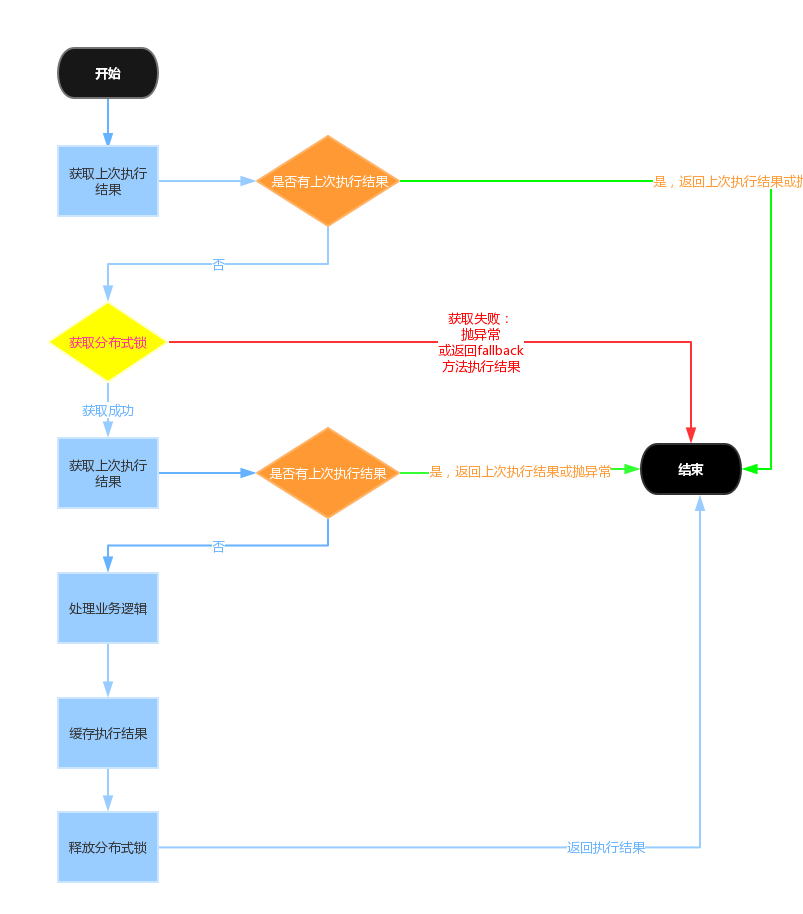
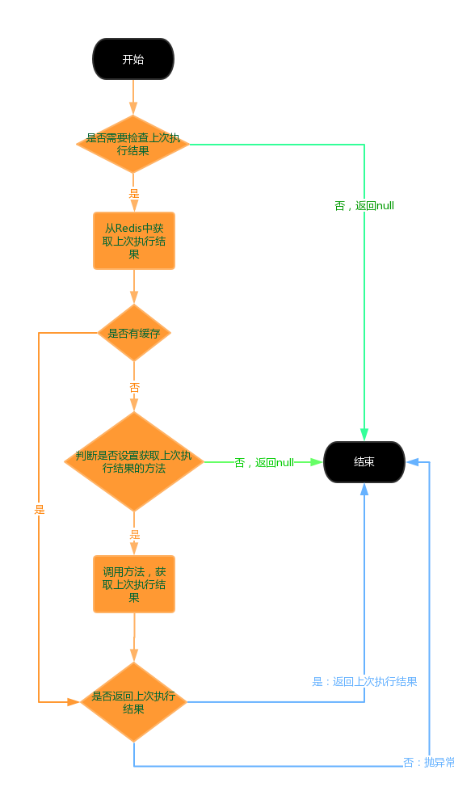

# 分布式锁及幂等
作者：邱家榆

---

## 1. 为什么要使用分布式锁？
分布式场景中的数据一致性问题一直是一个比较重要的话题。分布式的CAP理论告诉我们“任何一个分布式系统都无法同时满足一致性（Consistency）、可用性（Availability）和分区容错性（Partition tolerance），最多只能同时满足两项。”所以，很多系统在设计之初就要对这三者做出取舍。在互联网领域的绝大多数的场景中，都需要牺牲强一致性来换取系统的高可用性，系统往往只需要保证“最终一致性”，只要这个最终时间是在用户可以接受的范围内即可。

在很多场景中，我们为了保证数据的最终一致性，需要很多的技术方案来支持，比如分布式事务、分布式锁等。有的时候，我们需要保证一个方法在同一时间内只能被同一个线程执行。在单机环境中，Java中其实提供了很多并发处理相关的API，但是这些API在分布式场景中就无能为力了。也就是说单纯的Java Api并不能提供分布式锁的能力。所以针对分布式锁的实现目前有多种方案。

针对分布式锁的实现，目前比较常用的有以下几种方案：

* 基于数据库实现分布式锁 
* 基于缓存（redis）实现分布式锁
* 基于Zookeeper实现分布式锁

此组件中已经实现了基于Redis和Zookeeper实现的分布式锁，如果系统中依赖了Zookeeper会优先使用Zookeeper的分布式锁

## 2. 幂等的概念

幂等操作的特点是其任意多次执行所产生的影响均与一次执行的影响相同。幂等函数，或幂等方法，是指可以使用相同参数重复执行，并能获得相同结果的函数。白话就是：避免重复执行造成业务错误。

有些业务天生就是支持幂等的，比如定单状态的更新，通过乐观锁就能保证其幂等，但所有重复提交都去数据库判断，势必影响系统的性能。在保留数据库乐观锁的前提下，把上次成功执行的结果缓存起来，就能很好解决这个问题。而在这个执行过种中是存在有竞争关系的，所以需要使用分布锁来保证其一致性。此组件中实说的幂等就是通过使用分布式锁，保护顺序执行，并把执行结果缓存起来，如果缓存过期失效，还是需要回到数据库层去保证。

而有些业务是不需要保证幂等，比如日志的记录。

## 3. 流程图
分布式锁及幂等主流程图：

上图中”获取上次执行结果“的流程图：

## 4. 引入依赖的jar

    compile "com.suixingpay.starter:suixingpay-starter-distributed-lock:xxx"

到[http://172.16.60.188:8081/nexus/index.html#nexus-search;quick~suixingpay-starter-distributed-lock](http://172.16.60.188:8081/nexus/index.html#nexus-search;quick~suixingpay-starter-distributed-lock)获取最新版本的jar.

## 5. spring boot 配置

    suixingpay:
	  distributedlock:
	    # 多模块或多业务共用时，使用namespace进行区分，避免KEY冲突
	    # 指定namespace，如果此namespaceEnable为true，此处没有设置，则会使用spring.application.name作为namespace
	    namespace: test
	    # 是否开启namespace功能，默认为true,如果不需要使用namespace，需要把此配置设置为false
	    namespaceEnable: true
	    # AOP 执行顺序，默认值为0
	    aopOrder: 0
	    # 配置zookeeper。如果配置了此项，则优先使用zookeeper实现分布式锁，否则使用Redis进行分布式锁
	    # zkServers:10.7.100.95:2181,10.7.100.96:2181,10.7.100.115:2181
	    
    
## 6. @DistributedLock 注解说明

    public @interface DistributedLock {
        /**
         * 锁的key,支持Spring EL表达式。
         * 
         * @return
         */
        String key() default "";
    
        /**
         * 锁的租约时间，单位是秒，默认120秒。当前线程在获取到锁以后，在租约时间到期以后，会自动释放锁。如果在租约时间到期之前，方法执行完毕了，也会释放锁。
         * 
         * @return
         */
        int leaseTime() default 120;
    
        /**
         * 尝试次数。如果尝试了指定的次没有获取到就立即抛出异常。 
         * 
         * @return
         */
        int tryCnt() default 0;
    
        /**
         * 尝试重新获取锁的时间间隔，单位是毫秒，默认为10。
         * 
         * @return
         */
        int interval() default 10;
    
        /**
         * 如果获取分布式锁失败时，快速失败的方法。 
         * 注意：参数和返回值类型必须与当前方法完全一样。 
         * 如果没有设置fallbackMethod，则抛出异常。
         * 
         * @return
         */
        String fallbackMethod() default "";
    
        /**
         * 检查业务是否已经处理过，避免重复提交。如果设置为true，会使用key()+"_last_result"作为缓存key,缓存上次执行结果。 
         * 当缓存中存在值时，根据returnLastResult设置决定是直接抛异常，还是返回缓存中的值。 
         * 注意：此缓存失效后，如果还有重复提交，需要使用乐观锁进行处理。 
         * 默认值为false 
         * 
         * @return
         */
        boolean checkBusinessFinished() default false;
    
        /**
         * 验证业务已完成方法（最终去数据库中验证的方法） 
         * 当checkBusinessFinished 设置为true时有效。当Redis中的数据过期后才会调此方法。 
         * 设置的方法参数必须与当前方法完全一样 
         * 返回值必须是{link BusinessResult}
         * 
         * @return
         */
        String checkBusinessFinishedMethod() default "";
    
        /**
         * 设置为true时，如果业务已经处理完成，则直接返回上次处理结果。设置为false时，如果业务已经处理完成，则抛异常。
         * 
         * @return
         */
        boolean returnLastResult() default true;
    
        /**
         * 业务已完成异常消息，支持Spring EL表达式。
         * 
         * @return
         */
        String businessFinishedMessage() default "";
    
        /**
         * 业务状态缓存的过期时间，单位：秒，如果为0则表示永久缓存
         * 
         * @return 时间
         */
        int businessStatusExpire() default 120;
    }
    
## 7. 以注解的方式使用：

    @DistributedLock(key="'updateUser_lock_'+#args[0].id")
    public void updateUser(User user) {
        ... ...
    }
    
    @DistributedLock(key = "'update_user_wfb_lock_'+#args[0].id", fallbackMethod = "fallback")
    public boolean updateUserWithFallback(User user) {
        ... ...
        return true;
    }
    
    public boolean fallback(User user) {
        return false;
    }
    
    @DistributedLock(key = "'update_user1_lock_'+#args[0].id", tryCnt = 10, checkBusinessFinished=true, businessFinishedMessage = "'had update user'+#args[0].id")
    public void updateUser1(User user) {
        ... ...
    }
    
## 8. 嵌入代码中使用分布式锁

    @Autowired
    private IDistributedLock distributedLock;
    
    public Object test(){
        ... ...
        if (!distributedLock.tryLock(key, 60, 3, 10)) {
            return fallback(....);
        }
        logger.debug("acquire DistributedLock for [{}]", key);
        try {
            ... ...
        } catch (Throwable e) {
            throw e;
        } finally {
            distributedLock.release(key);
        }
        ... ...
    }

## 9. 使用建议

在需要判断业务状态，避免重复提交数据时，建议把tryCnt设置为大于0的数字（最好是能接tryCnt*interval大于业务可能需要的要时间），尽量减少触发fallbackMethod。

注意：在AOP中抛出在方法中未申明的异常时，捕获到的是UndeclaredThrowableException, 通过它的getUndeclaredThrowable()方法获取真实的异常信息。

    Throwable throwable=ex;
    if (ex instanceof UndeclaredThrowableException) {
        UndeclaredThrowableException e1 = (UndeclaredThrowableException) ex;
        throwable = e1.getUndeclaredThrowable();
    }
