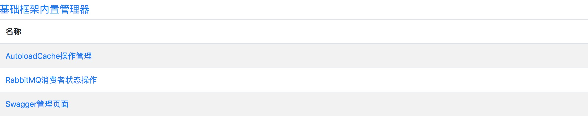

# 管理器

作者：邱家榆，汤启华

---

基础框架中内置了一些管理器，为了安全考虑，需要对这些管理器，增加安全验证功能。此模块的主要作用就是针对这些管理器增加登录、以及登录验证功能。

## 快速上手
### 1. 获取最新版本
[获取最新版本](http://172.16.60.188:8081/nexus/index.html#nexus-search;quick~suixingpay-starter-manager)

### 2. 配置

yml示例:

	suixingpay:
	  manager:
	    enabled: true # 是否开启，默认true
	    user-name: admin # 用户名， 默认admin
	    password: sxfAdmin # 密码， 默认sxfAdmin
	    session-name: sxf_manager_auth  # session名称，默认sxf_manager_auth
	    url-patterns: # 权限拦截路径，默认为空
	    - /user/*, 
	    - /test/*  
	    urls:
	    - 
	      title: 随行付
	      url: https://vbill.cn/
	    - 
	      title: 百度
	      url: http://www.baidu.com/

配置完后，框架不仅会对 url-patterns 路径集的访问进行拦截，默认还会对框架内置的一些web管理器进行拦截，例如 rabbitmq，swagger等。

### 3. 统一管理web
针对框架内置的一些管理器的一个统一管理web,主要是提供受权限控制的内置管理器的列表查询和访问(**默认基础框架的管理器都受权限控制**)

统一管理web访问地址:[http://localhost:8080/manager-ui.html](http://localhost:8080/manager-ui.html)

如若想将基础框架的管理器不受权限控制，则使用如下配置(Swagger管理器例子):

	suixingpay:
	  manager:
	    swagger:
	      enabled: false
	      
### 4. 将自定义的功能使用此管理器进行管理

支持两种方式可以将自定义的功能页面访问使用此管理器进行管理：

1. 通过yml配置的方式(3.0.1版本开始提供的功能)

		suixingpay:
		  manager:
		    url-patterns: # 配置需要拦截的url
		    - /user/*, 
		    - /test/*  
		    urls:         # 配置需要在管理页面显示的入口信息
		    - 
		      title: 随行付
		      url: https://vbill.cn/
		    - 
		      title: 百度
		      url: http://www.baidu.com/

2. 通过java代码进行注册，适合组件化开发时使用(以Swagger实现原理为例子)

		@Configuration
		@ConditionalOnWebApplication
		@AutoConfigureBefore(ManagerAutoConfiguration.class)
		@ConditionalOnClass(ManagerUrlRegistrationBean.class)
		@ConditionalOnProperty(value = SwaggerManagerConfiguration.PREFIX + ".enabled", matchIfMissing = true)
		public static class SwaggerManagerConfiguration {
		    public final static String PREFIX = "suixingpay.manager.swagger";
			
		    /**
	         * 配置管理器列表页面展示与链接需要的 url和title；  
	         * 注意：方法名必须是唯一的，不能重名，否则可能会注册不上； 
	         * @return
	         */
		    @Bean
		    public ManagerUrlRegistrationBean swaggerUrlRegistrationBean() {
		        ManagerUrlRegistrationBean registrationBean = new ManagerUrlRegistrationBean();
		        registrationBean.setTitle("Swagger管理页面");
		        registrationBean.setUrl("swagger-ui.html");
		        log.debug("注册管理web[{}]", registrationBean.getTitle());
		        return registrationBean;
		    }
		
		    /**
	         * 配置受管理器权限拦截的 url；  
	         * 注意：方法名必须是唯一的，不能重名，否则可能会注册不上； 
	         * @return
	         */
		    @Bean
		    public ManagerFilterUrlPatternsRegistrationBean swaggerFilterUrlPatternsRegistrationBean() {
		        Collection<String> urlPatterns = Arrays.asList("/swagger-ui.html" ,"/v2/api-docs");
		        log.debug("注册应用url[{}]到权限过滤器", StringUtils.collectionToCommaDelimitedString(urlPatterns));
		        return new ManagerFilterUrlPatternsRegistrationBean(urlPatterns);
		    }
		}