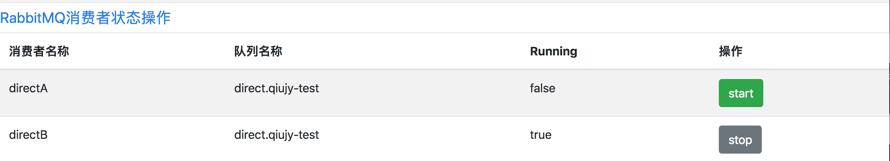
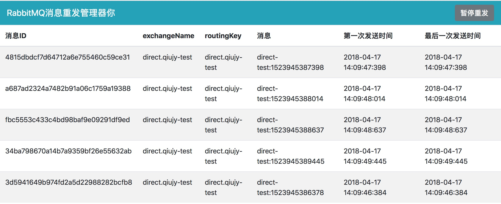
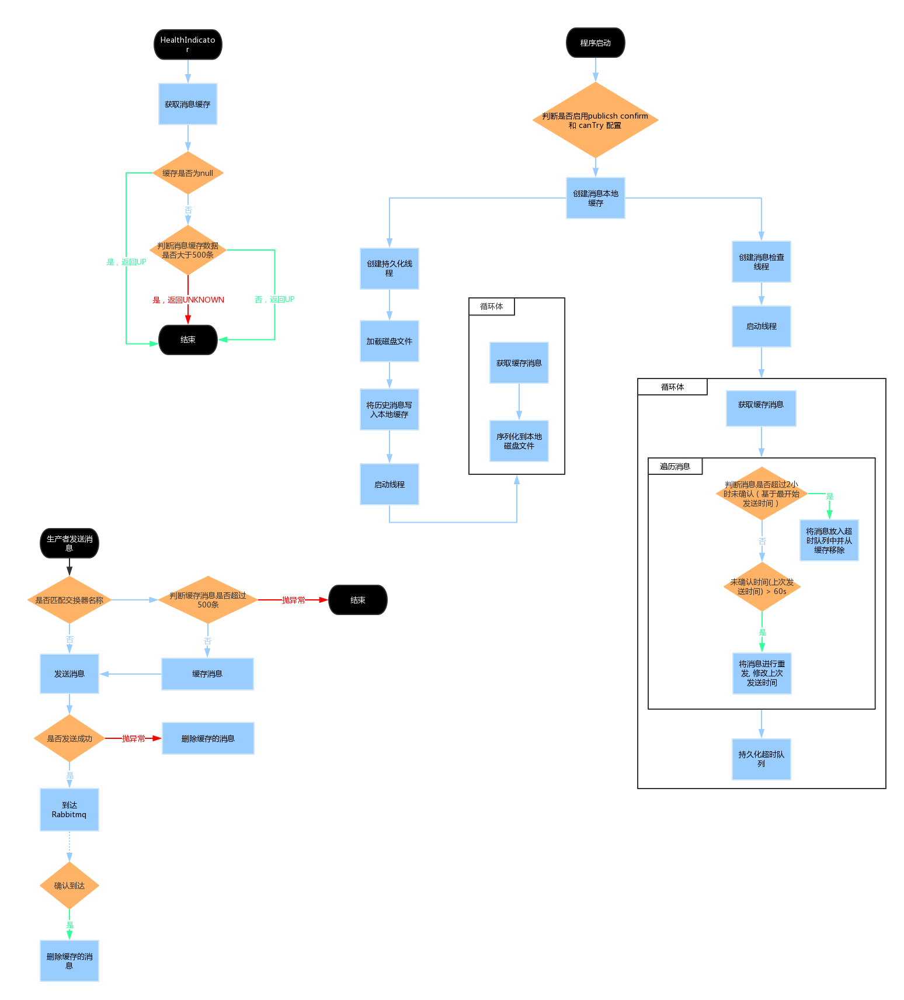

# RabbitMQ

作者：邱家榆

---

## 1. Rabbit MQ 基础知识

在使用Rabbit MQ之前，必须理解它的一些基础知识，才能结合其特性满足不同业务场景的需求。

1. 生产者(Producer): 投递消息的一方

  生产者创建消息，然后对消息体进行序列化+消息的标签发送给RabbitMQ。
  
2. 消费者(Consumer): 接收消息的一方

    消费者连接到RabbitMQ 服务器，并订阅队列中消息。消费者接收到消息后，先进行反序列化，然后消费进行处理。
    
3. Broker: 消息中间件的服务节点

  对于RabbitMQ来说，一个RabbitMQ broker可以简单看作一个RabbitMQ服务节点或服务实例。
  
4. 队列(Queue)：用于存储消息的对象

  RabbitMQ 中消息都只存储在队列中。

  注意：**多个消费者可以订阅同一个队列，这时队列中的消息会被平均分摊(Round-Robin,即轮询)，给多个消费者进行处理，而不是每个消费者都收到所有的消息并处理**。
  
5. 交换器、绑定、路由键

  * 交换器(Exchange)： 生产者把消息发送到交换器，由交换器将消息路由到一个或多个队列中(可以把它想像成路由器的功能)。如果路由不到，或许返回给生产者，或许直接丢弃。**如果消息不允许有丢失的情况，需要在生产者发送消息之前在确保交换器、队列、绑定都已经创建好**。

  * 绑定(Binding):RabbitMQ通过绑定将交换器与队列关联起来，在绑定的时候会指定一个绑定键(BindingKey)，这样RabbitMQ就知道如何正确地将消息路由到队列。

  * 路由键(RoutingKey):生产者将消息发送给交换器时，需要一个RoutingKey,当BindingKey和RoutingKey相匹配时，消息被路由到对应的队列中。RabbitMQ Java API中都把BindingKey 和RoutingKey 看作RoutingKey，这里需要注意，不要混淆。 在Spring 中 BindingBuilder中使用的RoutingKey 其实就是 BindingKey;而在RabbitTemplate 中发送消息方法中使用的路由键，就是RoutingKey。

6. 交换器类型

  * **fanout**: 它会把所有发送到该交换器的消息路由到所有与该交换器绑定的队列中。交换器会将接收到的消息，为各个队列各复制一份，并放入这些队列之中，所以发送消息时不需要RoutingKey，绑定时也不需要BindingKey。

  * **direct**: direct类型的交换器路由规则也很简单，它会把消息路由到那些BindingKey和RoutingKey完全匹配的队列中。在实际使用过程中，我们通常把 BindingKey和RoutingKey 设置为队列名称，以方便使用。

  * **topic**: topic类型与direct类型都是通过BindingKey和RoutingKey 进匹配进行路由消息，但direct类型是要求BindingKey和RoutingKey完全匹配，而topic类型是通过BindingKey中的“\*”和“#”两个特殊字符进行模糊匹配来路由消息。其中\*用于匹配一个单词，#用于匹配多个单词（可以是零个）,单词与单词之间使用“\.” 进行分隔。

## 2. 在项目中增加jar 包的依赖

    compile "com.suixingpay.starter:suixingpay-starter-rabbitmq:xxx"
    
[获取最新版本jar](http://172.16.60.188:8081/nexus/index.html#nexus-search;quick~suixingpay-starter-rabbitmq)

## 3. RabbitMQ的配置

### 1. 生产者

	spring:
	  rabbitmq:
	    host: 172.16.135.138
	    port: 5672
	    username: guest
	    password: guest
	    publisher-confirms: true #支持发布确认， 用于记录消息没发送成功的情况
	    publisher-returns: true  #支持发布返回, 交换器无法根据自身的类型和路由键找到一个符合条件的队列，那么RabbitMQ会调用Basic.Redtun命令将消息返回给生产者。用于记录消息没发送成功的情况

spring.rabbitmq.publisher-confirms 和 spring.rabbitmq.publisher-returns 只是对生产者有用，建议都设置成true，当消息没有发送成功时会进行回调，同时需要实现MessageProducerCallback 接口，并注入到Spring中：

	@Configuration
	public class ProducerConfiguration {
	
	    @Bean
	    public MessageProducerCallback messageProducerCallback() {
	        return new MessageProducerCallback() {
	
	            /**
	             * 消息发送到RabbitMQ 交换器中情况，注意，此时还没有发送到消息者中  
	             * 当 spring.rabbitmq.publisher-confirms设置为true时生效  
	             * 在onConfirm中是没有原message的，所以无法在这个函数中调用重发，confirmCallback只有一个通知的作用
	             */
	            @Override
	            public void onConfirm(String id, boolean ack, String cause) {
	                if (ack) {
	                    System.out.println("消息 " + id + " 已经成功发送到交换器中");
	                } else {
	                    System.err.println("消息 " + id + " 因 " + cause + " 未能发送到交换器中");
	                }
	            }
	
	            @Override
	            public void onReturned(String messageId, Object message, int replyCode, String replyText, String exchange,String routingKey) {
	                System.err.println("消息:" + messageId + " 发送到交换器:" + exchange + " 后，无法根据自身的类型和路由键:" + routingKey + " 找到一个符合条件的队列");
	            }
	        };
	    }
	}

### 2. 消费者

	spring:
	  rabbitmq:
	    host: 172.16.135.138
	    port: 5672
	    username: guest
	    password: guest
	    
消费者的配置比较简单，因为我们只需要通过Spring boot获取 ConnectionFactory 即可。

## 4. 使用说明

根据交换器的类型，以及常用的场景，定义了四种类型的IDestination：

* DirectDestination 是针对direct类型的交换器的使用进行封装
* FanoutDestination 是针对fanout类型的交换器的使用进行封装
* BroadcastDestination 是 FanoutDestination 的变种，实现消息广播。
* TopicDestination 是针对topic类型的交换器的使用进行封装

为了更好理解各种IDestination的使用方法，下面给出了一些测试例子：

首先实现个简单的消息处理器：

   // MessageHandler<String>中的String 就是消息的数据类型
	
	public class TestMessageHandler extends MessageHandler<String> {
	
	    private final String consumerName;
	
	    private final boolean testAck;
	
	    public TestMessageHandler(String consumerName, boolean testAck) {
	        this.consumerName = consumerName;
	        this.testAck = testAck;
	    }
	    
	    public TestMessageHandler(String consumerName) {
	        this.consumerName = consumerName;
	        testAck = false;
	    }
	
	    // 3.0.3 版本增加了MessageProperties messageProperties参数，可以通过它的getAppId()获取生产者、getTimestamp()获取生产时间以及getHeaders()获取消息头等扩展信息
	    @Override
	    public void onMessage(String messageId, String message, MessageProperties messageProperties) throws Exception {
	        System.out.println(consumerName + "--->" + message);
	        if (testAck) {
	            throw new Exception("ack test");
	        }
	    }
	
	    @Override
	    public void onError(Throwable t) {
	        System.err.println(consumerName + "--->" + t.getMessage());
	    }
	}

### 1. DirectDestination 实例

生产者：

    @Autowired
    private SimpleMessageProducer simpleMessageProducer;

    @GetMapping("direct")
    public String directSender() {
        String exchangeName="direct.qiujy-test"; // 交换器名称
        String queueName="direct.qiujy-test"; // 队列名称
        IDestination destination = new DirectDestination(exchangeName, queueName);
        // 如果使用默认交换器，只需要传入队列名称
        // DirectDestination destination = new DirectDestination(queueName);
        try {
            simpleMessageProducer.sendMessage(destination, "direct-test:"+System.currentTimeMillis());            return "OK";
        } catch (Exception e) {
            e.printStackTrace();
        }
        return "error";
    }
    
消费者：

	@Configuration
	public class ConsumerConfiguration {
	    @Autowired
	    private ConnectionFactory connectionFactory;
	
	        @Bean
		    public SimpleMessageConsumer<String> directA() {
		        String exchangeName = "direct.qiujy-test";
		        String queueName = "direct.qiujy-test";
		        DirectDestination destination = new DirectDestination(exchangeName, queueName);
		        String consumerName = "directA";
		        boolean testAck = false;
		        SimpleMessageConsumer<String> consumer = new SimpleMessageConsumer<String>(connectionFactory, destination, new TestMessageHandler(consumerName, testAck));
		        // consumer.setAcknowledgeMode(AcknowledgeMode.MANUAL);
		        return consumer;
		    }
		
		    @Bean
		    public SimpleMessageConsumer<String> directB() {
		        String exchangeName = "direct.qiujy-test";
		        String queueName = "direct.qiujy-test";
		        DirectDestination destination = new DirectDestination(exchangeName, queueName);
		        String consumerName = "directB";
		        boolean testAck = false;
		        SimpleMessageConsumer<String> consumer = new SimpleMessageConsumer<String>(connectionFactory, destination, new TestMessageHandler(consumerName, testAck));
		        // consumer.setAcknowledgeMode(AcknowledgeMode.MANUAL);
		        return consumer;
		    }
	}
	
在浏览器中访问4次：http://localhost:8080/direct，打印：

	directA--->direct-test:1520341437722
	
	directB--->direct-test:1520341439662
	
	directA--->direct-test:1520341441563
	
	directB--->direct-test:1520341443466

消息会在 directA 和 directB 两个消费者之间进行轮询。

默认情况消费者使用自动ACK模式进行消费（接收到消费后，立即通知MQ删除消息）， 这样会带来一个问题，如果消费者处理的流程比较长，而在这个过程中应用程序突然被结束了，那么就会造成业务未完成的情况。我们可以把directA方法中的 testAck 设置为true; 前面的注释删除进行验证这一情况，打后注释后再执行1次 http://localhost:8080/direct，打印：

	directA--->direct-test:1520341437722
	异常信息... ...
	
此时消息并没有路由到directB中。

我们再将上面 consumer.setAcknowledgeMode(AcknowledgeMode.MANUAL); 代码前的注释删除，再执行1次 http://localhost:8080/direct，打印：

	directA--->direct-test:1520341437722
	异常信息... ...
	directB--->direct-test:1520341437722

此时消息又路由到directB，通过这种手动ack的方式，可以有效避免漏消费的情况。

### 2. FanoutDestination 实例

生产者：

    @Autowired
    private SimpleMessageProducer simpleMessageProducer;

    @GetMapping("fanout")
    public String sender() {
        // 生产者只需要设置交换器名字
        String exchangeName="fanout.qiujy-test";
        FanoutDestination destination = new FanoutDestination(exchangeName);
        try {
            simpleMessageProducer.sendMessage(destination, "fanout-test:"+System.currentTimeMillis());
            return "OK";
        } catch (Exception e) {
            e.printStackTrace();
        }
        return "error";
    }

消费者：

    @Bean
    public SimpleMessageConsumer<String> fanoutA() {
        String exchangeName = "fanout.qiujy-test";
        String queueName = "fanout.qiujy-test-queue-a";
        FanoutDestination destination = new FanoutDestination(exchangeName, queueName);
        String consumerName = "fanoutA";
        boolean testAck = false;
        return new SimpleMessageConsumer<String>(connectionFactory, destination, new TestMessageHandler(consumerName, testAck));
    }

    @Bean
    public SimpleMessageConsumer<String> fanoutB() {
        String exchangeName = "fanout.qiujy-test";
        String queueName = "fanout.qiujy-test-queue-b";
        FanoutDestination destination = new FanoutDestination(exchangeName, queueName);
        String consumerName = "fanoutB";
        boolean testAck = false;
        return new SimpleMessageConsumer<String>(connectionFactory, destination, new TestMessageHandler(consumerName, testAck));
    }

    @Bean
    public SimpleMessageConsumer<String> fanoutB1() {
        String exchangeName = "fanout.qiujy-test";
        String queueName = "fanout.qiujy-test-queue-b";
        FanoutDestination destination = new FanoutDestination(exchangeName, queueName);
        String consumerName = "fanoutB1";
        boolean testAck = false;
        return new SimpleMessageConsumer<String>(connectionFactory, destination, new TestMessageHandler(consumerName, testAck));
    }

调用 http://localhost:8080/fanout 4次，打印结果如下：

	fanoutB--->fanout-test:1520344022010
	fanoutA--->fanout-test:1520344022010
	
	fanoutA--->fanout-test:1520344024138
	fanoutB1--->fanout-test:1520344024138
	
	fanoutA--->fanout-test:1520344026314
	fanoutB--->fanout-test:1520344026314
	
	fanoutB1--->fanout-test:1520344028473
	fanoutA--->fanout-test:1520344028473

### 3. BroadcastDestination 实例

生产者：

    @GetMapping("broadcast")
    public String broadcast() {
        // 生产者只需要设置交换器名字
        String exchangeName="broadcast.qiujy-test";
        BroadcastDestination destination = new BroadcastDestination(exchangeName);
        try {
            simpleMessageProducer.sendMessage(destination, "broadcast-test:"+System.currentTimeMillis());
            return "OK";
        } catch (Exception e) {
            e.printStackTrace();
        }
        return "error";
    }
    
消费者：

    @Bean
    public SimpleMessageConsumer<String> broadcastA() {
        String exchangeName = "broadcast.qiujy-test";
        String queueNamePrefix = "broadcast.a.";
        BroadcastDestination destination = new BroadcastDestination(exchangeName, queueNamePrefix);
        String consumerName = "broadcastA";
        boolean testAck = false;
        return new SimpleMessageConsumer<String>(connectionFactory, destination, new TestMessageHandler(consumerName, testAck));
    }

    @Bean
    public SimpleMessageConsumer<String> broadcastB() {
        String exchangeName = "broadcast.qiujy-test";
        String queueNamePrefix = "broadcast.b.";
        BroadcastDestination destination = new BroadcastDestination(exchangeName, queueNamePrefix);
        String consumerName = "broadcastB";
        boolean testAck = false;
        return new SimpleMessageConsumer<String>(connectionFactory, destination, new TestMessageHandler(consumerName, testAck));
    }

调用 http://localhost:8080/broadcast 4次，打印结果如下：

	broadcastA--->broadcast-test:1520344487964
	broadcastB--->broadcast-test:1520344487964
	
	broadcastA--->broadcast-test:1520344489617
	broadcastB--->broadcast-test:1520344489617
	
	broadcastA--->broadcast-test:1520344490931
	broadcastB--->broadcast-test:1520344490931
	
	broadcastA--->broadcast-test:1520344492211
	broadcastB--->broadcast-test:1520344492211
	
BroadcastDestination 中使用UUID生成唯一的队列名称，以达到队广播的效果。

### 4. TopicDestination 实例

生产者：

    @GetMapping("topic")
    public String topic() {
        // 日志收集
        String exchangeName = "topic.qiujy-logs-exchange";
        try {
            // 系统A的error日志
            sendTopic(exchangeName, "systemA.error.log", "systema-error-message-1");
            // 系统B的error日志
            sendTopic(exchangeName, "systemB.error.log", "systemb-error-message-2");
            // 系统A的info日志
            sendTopic(exchangeName, "systemA.info.log", "systema-info-message-3");
            // 系统B的info日志
            sendTopic(exchangeName, "systemB.info.log", "systemb-info-message-4");
            return "OK";
        } catch (Exception e) {
            e.printStackTrace();
        }
        return "error";
    }

    private void sendTopic(String exchangeName, String routingKey, String message) throws Exception {
        TopicDestination destination = new TopicDestination(exchangeName, routingKey);
        simpleMessageProducer.sendMessage(destination, message);
    }
    
消费者：

    @Bean
    public SimpleMessageConsumer<String> systemAErrorLog() {
        String exchangeName = "topic.qiujy-logs-exchange";
        String queueName = "topic.qiujy-test-system-a-error-log";
        String bindingKey = "systemA.error.log";
        TopicDestination destination = new TopicDestination(exchangeName, queueName, bindingKey);
        String consumerName = "systemAErrorLog";
        boolean testAck = false;
        return new SimpleMessageConsumer<String>(connectionFactory, destination, new TestMessageHandler(consumerName, testAck));
    }
    
    @Bean
    public SimpleMessageConsumer<String> systemAAllLog() {
        String exchangeName = "topic.qiujy-logs-exchange";
        String queueName = "topic.qiujy-test-system-a-all-log";
        String bindingKey = "systemA.*.log";
        TopicDestination destination = new TopicDestination(exchangeName, queueName, bindingKey);
        String consumerName = "systemAAllLog";
        boolean testAck = false;
        return new SimpleMessageConsumer<String>(connectionFactory, destination, new TestMessageHandler(consumerName, testAck));
    }
    
    @Bean
    public SimpleMessageConsumer<String> systemBAllLog() {
        String exchangeName = "topic.qiujy-logs-exchange";
        String queueName = "topic.qiujy-test-system-b-all-log";
        String bindingKey = "systemB.*.log";
        TopicDestination destination = new TopicDestination(exchangeName, queueName, bindingKey);
        String consumerName = "systemBAllLog";
        boolean testAck = false;
        return new SimpleMessageConsumer<String>(connectionFactory, destination, new TestMessageHandler(consumerName, testAck));
    }
    
    @Bean
    public SimpleMessageConsumer<String> allSystemAllLog() {
        String exchangeName = "topic.qiujy-logs-exchange";
        String queueName = "topic.qiujy-test-all-system-all-log";
        String bindingKey = "#";
        TopicDestination destination = new TopicDestination(exchangeName, queueName, bindingKey);
        String consumerName = "allSystemAllLog";
        boolean testAck = false;
        return new SimpleMessageConsumer<String>(connectionFactory, destination, new TestMessageHandler(consumerName, testAck));
    }

在浏览器中访问http://localhost:8080/topic，消费者打印结果：

	systemAErrorLog--->systema-error-message-1
	systemAAllLog--->systema-error-message-1
	allSystemAllLog--->systema-error-message-1
	
	
	systemBAllLog--->systemb-error-message-2
	allSystemAllLog--->systemb-error-message-2
	
	
	systemAAllLog--->systema-info-message-3
	allSystemAllLog--->systema-info-message-3
	
	systemBAllLog--->systemb-info-message-4
	allSystemAllLog--->systemb-info-message-4

## 5.框架内置的web管理
#### 注意事项
需要依赖suixingpay-starter-manager页面才能正常显示。出现权限认证问题或其他关于管理器的问题请查阅**框架管理器**文档
#### 1.RabbitMQ消费者状态管理
项目启动后，直接通过访问 [http://localhost:8080/rabbitmq-ui.html](http://localhost:8080/rabbitmq-ui.html)进入管理页面，查看消费者状态并进行管理。

**说明：**消费者start和stop，当消费者stop后，不会拉取队列中的消息，消息不会丢失，当再次start消费者时，消费者会自动拉取队列消息并消费。

#### 2.RabbitMQ消息重发管理器
访问地址[http://localhost:8080/rabbitmq-retry-ui.html](http://localhost:8080/rabbitmq-retry-ui.html)进入管理页面，查看进入重发队列的未确认消息。

## 6. 消费者保证消息不丢失的措施

SimpleMessageConsumer **默认**使用**自动ACK模式**进行消费消息，如果需要保证消息不会有丢失，必须使用手动ACK模式，设置方法：consumer.setAcknowledgeMode(AcknowledgeMode.MANUAL); 当MessageHandler.onMessage抛异常时，将会发nack消息给MQ，将当前消息重新入队列，进行下一次投递。

在高并发场景下，使用手动ACK模式可能会造成消息堆积比较严重，为了解决这个问题，建议消息接收到后，直接写入数据库，写入成功后，再执行ACK，然后再使用定时任务去扫数据库的数据进行消费。一方面保证消息不丢失，另一方面还可以保证消息不容易堆积。

参考资料：[rabbitmq可靠确认模式的java封装及示例](https://www.jianshu.com/p/4112d78a8753)

## 7. 生产者保证消息不丢失的措施(3.0.1版本已实现)

参考资料：[rabbitmq可靠发送的自动重试机制](https://www.jianshu.com/p/6579e48d18ae)

为了保证消息能发送到MQ，需要将 spring.rabbitmq.publisher-confirms 设置为true, 通过MQ的confirm功能确认消息是否发送成功。处理流程如下：

1. 发送消息时，先把消息进行本地缓存；
2. 发送消息；
3. 在收到confirmCallback 消息后，如果是成功ack的则将消息从缓存中删除；
4. 在应用启动时开启定时任务，定时检查本地缓存中，超过一定时间没有ack的消息，并进行重发送；
5. 应用运行过程中，会每隔1秒将本缓存写到磁盘；应用在下次启动时，将其重新加载回本地缓存，进行重新处理。为了保证性能不是实时保证数据，所以可能会丢失1秒的数据；在程序重启时，有可能没有收到ack消息，所以可能会造成重发。

**注意**：通过上面6、7点内容的说明，会出现消息重复消费问题，所以一定要保证**幂等性**。

### 1. 流程图
RabbitMQ消息重发机制流程图：

### 2.yml配置

	suixingpay:
	  rabbitmq:
	    retry:
	      enabled: true                       #是否启动重发机制 及 spring.rabbitmq.publisher-confirms 都设置为true时才有效
	      local-cache-path: ./rabbitmq-cache/ #本地缓存路径，默认值为./rabbitmq-cache/
	      over-time: 3600000                  #MQ消息超时时间（单位：毫秒），默认值为1小时 
	      alarm-capacity: 300                 #本地缓存警告容量（本地缓存消息数量达此值是开始告警），默认值为300
	      exclude-exchange-names:             #排除的交换器名称，默认为空
	      - aExchange
	      - bExchange
	      max-capacity: 1000                  #本地缓存最大容量，如果超过此容易，将禁发送消息，默认值为1000
	      persistent-interval: 1000           #MQ消息本地化间隔（单位：毫秒）, 默认值为1000毫秒
	      retry-interval: 60000               #MQ消息retry间隔时间单位：毫秒），默认值为1分钟

## 8. 序列化方式

因为MQ经常是用于解耦，所以就会有生产者和消费者不是在同一个应用中的情况，为了更好符合此场景的使用，此框架强制使用json进行序列化和反序列化(btye[] 和 String 类型数据除外)。所以生产者在发送消息时，不再需要将消息转成json然后再发送，可以将任何对象直接发送，消费者也不需要以字符串的格式进行接收，然后再转成实际需要的类型，而是将类型信息设置到MessageHandler泛型中即可。

首先介绍生产者发送消息时，可能会用到的一个非常重要的参数：

    /**
     * @param destination IDestination实例
     * @param message 消息内容
     * @param messageProperties MessageProperties，用于设置消息属性
     * @throws Exception
     */
    public void sendMessage(IDestination destination, Object message, MessageProperties messageProperties)
    
上面方法是SimpleMessageProducer中发送消息的方法，其中MessageProperties 可以设置messageId, contentType等属性。

序列化的详细规则如下：

1. 如果发送的内容是byte[]的话，不进行序列化，直接发送，MessageProperties中的contentType为：CONTENT\_TYPE\_BYTES = "application/octet\-stream";
2. 如果发送的内容是String的话，也不进行序列化，直接使用UTF-8编码转成byte[], MessageProperties中的contentType为：CONTENT\_TYPE\_TEXT\_PLAIN = "text/plain";
3. 如果是非byte[]和String类型的消息，默认情况下使用 Json进行序列化，也可以通过设置sendMessage方法中messageProperties的contentType属性。比如为了兼容老的 common-amqp-rabbitmq 框架，那就需要通过：messageProperties.setContentType(MessageProperties.CONTENT\_TYPE\_SERIALIZED\_OBJECT)，强制要求使用JDK序列化。

## 9. 参考资料

[springboot+rabbitmq整合示例程](https://www.cnblogs.com/boshen-hzb/p/6841982.html)

[rabbitmq的发布确认和事务](https://my.oschina.net/lzhaoqiang/blog/670749)
