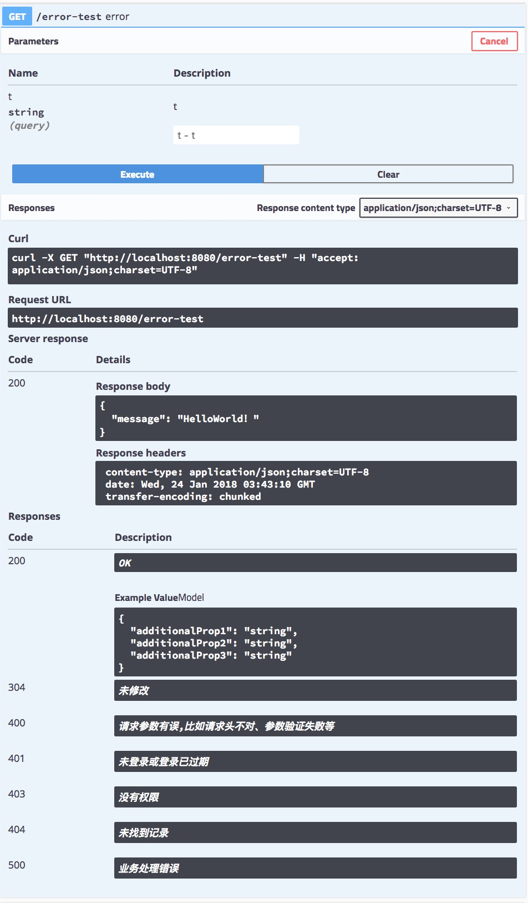
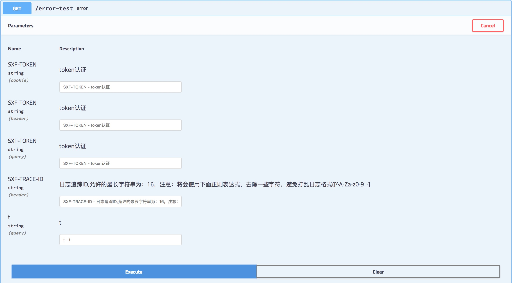
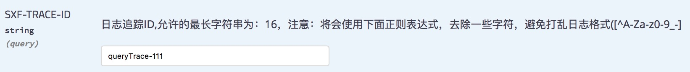
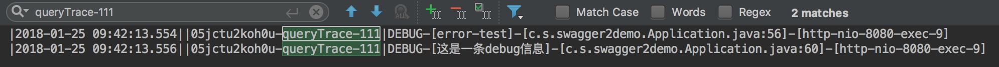

# swagger starter
作者：邱家榆、汤启华

---

## 1. 摘要说明

swagger2能帮助我们生成接口文档，是个非常强大的工具，它潜在着非常多有趣且实用的功能。

1. 接口文档分组
2. 接口状态码信息展示；
3. 全局公共参数的展示；

## 2. 接口状态码信息展示

如上图所示，其中 code, 200, 304, 400, 401, 403, 404, 500 等状态码信息展示，方便接口使用者，针对这些状态码进行异常处理；

## 3. 全局公共参数的展示

上图中有 SXF-TOKEN 和 SXF-TRACE-ID 两个参数，以及这两个参数支持传参的方式，可以通过 查询参数、http 头、Cookie等方式。
 
 如果系统依赖了 suixingpay-starter-logback 包，才会在swagger页面增加此SXF-TRACE-ID，通过传入唯一的 SXF-TRACE-ID，方便查看本次请求所产生的日志，方便我们调试、排查问题。例如：

对应控制台日志为

 
 如果依赖了suixingpay-starter-token包，才会在swagger页面增加此SXF-TOKEN。
 
此处需要注意的是即使排除路径全局参数输入框也会在swagger显示；

这些参数名称**可定制**。

## 4. 导入依赖包

    compile "com.suixingpay.starter:suixingpay-starter-swagger2:xxx"

通过 [http://172.16.60.188:8081/nexus/index.html#nexus-search;quick~suixingpay-starter-swagger2](http://172.16.60.188:8081/nexus/index.html#nexus-search;quick~suixingpay-starter-swagger2)  获取最新版本的jar。

## 5. 增加swagger2的配置 

    suixingpay: 
      swagger2: 
        enabled: true # 是否开启，默认值为true
        title: 标题 
        description: 描述
        version: 1.0.0 #版本
        license: 随行付 # 有默认值，可以不设置
        licenseUrl: http://vbill.cn # 有默认值，可以不设置
        termsOfServiceUrl: http://vbill.cn # 有默认值，可以不设置
        contact:  # 联系人信息
          name: 联系人姓名
          url: 联系人主页
          email: 联系人邮箱
        base-package: com.suixingpay.swagger2demo # 扫包路径
        base-path: /** # 有默认值，可以不设置
        exclude-path: /error, /ops/**

## 6.代码和图例
	
	@Slf4j
	@RestController
	public class SwaggerController {
    	@GetMapping("/error-test")
    	public Map<String,String> error(@RequestParam(required=false) String t) throws BaseException {
	        Map<String,String> data = new HashMap<>();
	        log.debug("error-test");
	        if(null != t && t.length()>0) {
	            throw new SystemException("异常测试");
	        }
	        data.put("message","HelloWorld！");
	        return data;
    	}
    }
    
启动项目访问swagger地址
<http://localhost:8080/swagger-ui.html/>

## 7.框架管理模块
当项目存在 **suixingpay-starter-manager** 依赖时，swagger默认受权限控制，更多详情请查阅 框架管理器 的说明文档